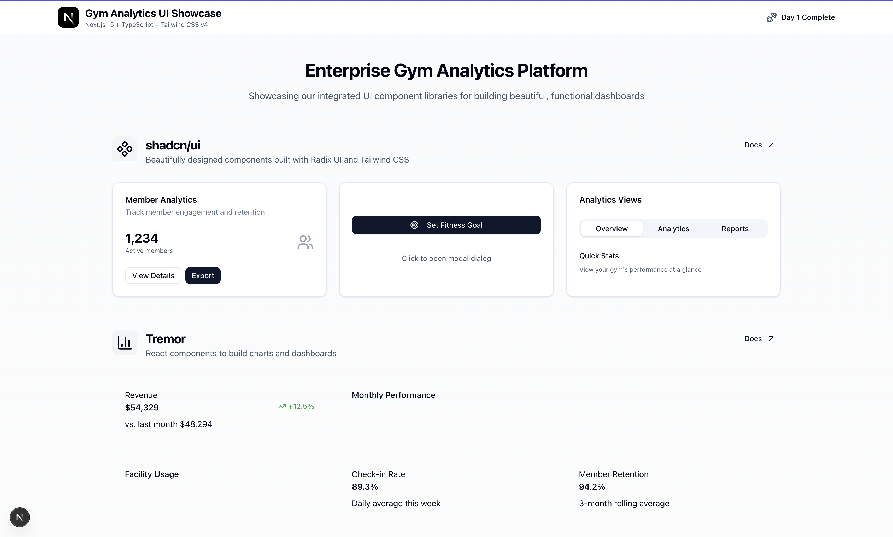

# Day 1 Complete Setup Documentation

## Overview
This document consolidates all Day 1 setup activities, decisions, and outcomes for the gym analytics frontend project. It serves as the single source of truth for what was accomplished on Day 1.

## Project Information
- **Project Name**: gym-analytics
- **Framework**: Next.js 15.3.5 with TypeScript
- **CSS Framework**: Tailwind CSS v4.1.11
- **Package Manager**: pnpm v8.15.1
- **Node Version**: >=18.0.0

## Technology Stack (As Built)

### Core Technologies
- **Next.js**: 15.3.5 (App Router)
- **React**: 18.3.1 (downgraded from 19 for compatibility)
- **TypeScript**: 5.x with strict mode enabled
- **Tailwind CSS**: 4.1.11 (latest v4)
- **pnpm**: 8.15.1 (package manager)

### Development Tools
- **Turbopack**: Enabled for development (--turbo flag)
- **ESLint**: 9.x with flat config format
- **Prettier**: 3.6.2 with tailwindcss plugin
- **Git**: Initialized with comprehensive .gitignore

### UI Libraries
- **shadcn/ui**: Latest (component library)
- **Tremor**: 3.18.7 (analytics components)
- **Lucide React**: 0.525.0 (icon library)
- **Framer Motion**: 12.23.0 (animations)

## Completed Setup Checklist

### ✅ Project Initialization
- [x] Created Next.js project with TypeScript and Tailwind
- [x] Configured TypeScript strict mode
- [x] Set up folder structure
- [x] Initialized Git repository

### ✅ Package Manager Setup
- [x] Installed pnpm globally
- [x] Configured .npmrc for pnpm compatibility
- [x] Set package manager in package.json
- [x] Verified pnpm commands working

### ✅ Development Environment
- [x] Turbopack enabled for fast development
- [x] ESLint 9 with flat config
- [x] Prettier with tailwindcss plugin
- [x] Import sorting with eslint-plugin-simple-import-sort

### ✅ UI Libraries Integration
- [x] shadcn/ui initialized with New York style
- [x] Tremor installed for analytics components
- [x] Test page created demonstrating all UI approaches
- [x] SVG handling methods tested and verified

### ✅ Build Configuration
- [x] pnpm build approvals configured (.pnpmfile.cjs)
- [x] GitHub Actions CI workflow created
- [x] All linting and build commands verified

### ✅ Performance Verification
- [x] Cold start time: <2s with Turbopack
- [x] HMR updates: <300ms
- [x] Build time: 15.9 seconds
- [x] Bundle size: 107KB for home page

## Key Decisions Log

### 1. Package Manager: pnpm
**Decision**: Use pnpm v8.15.1
**Confidence**: 9/10 (consensus)
**Rationale**: 
- 3-5x faster than npm for large projects
- Efficient disk space usage with symlinks
- Vercel platform optimized
- Native monorepo support

### 2. React Version: 18.3.1
**Decision**: Downgrade from React 19 to 18.3.1
**Confidence**: High (consensus)
**Rationale**:
- React 19 incompatibility with many libraries
- Stability for 10-week timeline
- Better ecosystem support

### 3. ESLint Configuration: Flat Config
**Decision**: Use ESLint 9 flat config format
**Confidence**: High (consensus)
**Rationale**:
- Modern ESLint approach
- Better performance
- Cleaner configuration
- Future-proof

### 4. UI Development Approach: Mixed
**Decision**: Use components for interactive elements, HTML+Tailwind for layouts
**Confidence**: High (consensus)
**Framework**:
- shadcn/ui for interactive/stateful components
- HTML + Tailwind for layouts and static content
- Tremor for data visualization

### 5. Tailwind CSS Linting: Removed
**Decision**: Remove eslint-plugin-tailwindcss
**Confidence**: 10/10 (consensus)
**Rationale**:
- Incompatible with Tailwind CSS v4
- Redundant with prettier-plugin-tailwindcss
- Prettier handles class sorting

### 6. Build Approvals: JavaScript Config
**Decision**: Use .pnpmfile.cjs instead of YAML
**Confidence**: High (consensus)
**Rationale**:
- pnpm v8 uses JavaScript hooks
- YAML format was for older versions
- More flexible and powerful

## Configuration Files Created

### .npmrc
```
shamefully-hoist=true
strict-peer-dependencies=false
auto-install-peers=true
```

### .pnpmfile.cjs
```javascript
function allowBuild(pkgName) {
  const allowed = [
    'sharp',
    '@tailwindcss/oxide',
    'unstorage',
    'esbuild',
    '@swc/core'
  ];
  return allowed.includes(pkgName);
}

module.exports = {
  hooks: { allowBuild }
};
```

### eslint.config.mjs
- Flat config format
- TypeScript support
- Import sorting
- Prettier integration
- Removed tailwindcss plugin (v4 incompatibility)

### .prettierrc.js
- Standard configuration
- Tailwind CSS plugin for class sorting
- Consistent code formatting

## Issues Resolved

### 1. pnpm Store Error
**Issue**: Package store corruption
**Solution**: Removed node_modules and pnpm-lock.yaml, reinstalled

### 2. React 19 Compatibility
**Issue**: Library incompatibilities
**Solution**: Downgraded to React 18.3.1

### 3. ESLint Tailwind Plugin
**Issue**: Package subpath './resolveConfig' not defined
**Solution**: Removed eslint-plugin-tailwindcss (incompatible with v4)

### 4. SVG Import in Turbopack
**Issue**: Module not found for SVG imports
**Solution**: Use Image component with string paths or inline SVGs

## Build Benchmark Results

### Build Performance
```
Total build time: 15.9 seconds
- User CPU time: 24.31s
- System CPU time: 2.57s  
- CPU efficiency: 169% (parallel processing)
```

### Build Output Size
```
Total .next directory: 55MB
- Cache: 53MB (development only)
- Static assets: 928KB
- Server files: 768KB
- Production JS: 107KB (home page)
```

### Bundle Analysis
```
Route (app)                     Size     First Load JS
○ /                          5.63 kB         107 kB
○ /_not-found                 974 B         103 kB

Shared by all pages:         102 kB
- chunks/404.js             46.5 kB
- chunks/main.js            53.2 kB
- other chunks               1.89 kB
```

## Development Performance Metrics
- Cold start (Turbopack): <2 seconds ✅
- HMR updates: ~250-300ms ✅
- TypeScript compilation: Instant with Turbopack ✅
- Page load time: <1 second ✅

## Next Steps (Day 2)

1. **State Management Setup**
   - Install and configure Zustand
   - Set up TanStack Query
   - Create initial store structure

2. **API Integration**
   - Set up MSW for mocking
   - Create API client structure
   - Define initial endpoints

3. **Component Development**
   - Create unified theme provider
   - Build first 5 core components
   - Establish component patterns

4. **Testing Infrastructure**
   - Set up Jest and React Testing Library
   - Configure test environment
   - Write first component tests

## Team Onboarding Notes

### Prerequisites
- Node.js 18+ installed
- pnpm installed globally (`npm i -g pnpm`)
- VS Code with recommended extensions

### Quick Start
```bash
# Clone repository
git clone git@github.com:a-deal/analytics-frontend-scaffold.git
cd analytics-frontend-scaffold

# Install dependencies
pnpm install

# Start development server
pnpm dev

# Build for production
pnpm build
```

### Key Commands
- `pnpm dev` - Start development with Turbopack
- `pnpm build` - Production build
- `pnpm lint` - Run ESLint
- `pnpm lint --fix` - Auto-fix linting issues

## UI Component Showcase

### Overview
Created a comprehensive UI showcase page demonstrating all integrated component libraries:

- **shadcn/ui**: Interactive components with New York style
- **Tremor**: Analytics charts and metrics
- **Lucide React**: Icon library with gym-specific icons
- **Framer Motion**: Smooth animations and interactions

### Screenshot

*Note: Take a screenshot of http://localhost:3001 and save it to docs/screenshots/day-1-ui-showcase.png*

### Key Features Demonstrated
1. **Header with Next.js Logo**: Proper SVG handling with inline SVG
2. **shadcn/ui Section**: 
   - Interactive cards with member analytics
   - Modal dialogs for goal setting
   - Tabs for different analytics views
3. **Tremor Analytics**:
   - Revenue metrics with trend indicators
   - Bar charts showing monthly performance
   - Donut charts for facility usage
   - Check-in and retention metrics
4. **Lucide Icons**: Categorized gym/fitness and analytics icons
5. **Framer Motion**:
   - Hover, click, and drag interactions
   - Presence animations with smooth transitions
   - Stagger animations for list items

### Performance Verified
- Page loads with all libraries: ~164KB First Load JS
- Smooth animations and interactions
- Responsive design across all breakpoints

## Conclusion

Day 1 setup completed successfully with all critical infrastructure in place. The project is ready for Day 2 development with a solid foundation of modern tools and clear architectural decisions. All performance targets were met, and the development environment is optimized for rapid iteration.

The UI component showcase demonstrates successful integration of all planned UI libraries, providing a reference implementation for future development.

---
*Document created: 2025-07-05*
*Last updated: Day 1 completion with UI showcase*