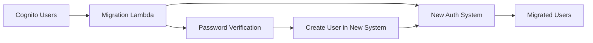

# Authentication Alternatives to AWS Cognito - Research Report

> **Document Type**: Technical Research Report
> **Date**: 2025-07-07
> **Purpose**: Evaluate best-in-class authentication alternatives to AWS Cognito for FleetOps
> **Focus**: Self-hosted and AWS-deployable solutions with IoT/M2M support

## Executive Summary

After comprehensive research into authentication alternatives to AWS Cognito, this report identifies and evaluates both open-source and commercial solutions suitable for FleetOps' requirements. Key considerations include self-hosting capabilities, AWS deployment patterns, IoT device authentication support, and migration complexity.

### Top Recommendations

1. **For Developer-Friendly Modern Solution**: SuperTokens
2. **For Enterprise Features & Compliance**: Keycloak
3. **For Flexible Architecture**: Ory (Kratos)
4. **For Cost-Effective Commercial**: FusionAuth
5. **For IoT-Specific**: Custom JWT/OAuth2 with mTLS

## Open Source Solutions

### 1. SuperTokens

**Overview**: Modern, developer-friendly authentication solution designed as a direct alternative to Auth0/Firebase Auth/AWS Cognito.

**Key Features**:
- Backend SDKs: Node.js, Golang, Python
- Frontend SDKs: React, VanillaJS, React Native
- Pre-built UI components for rapid integration
- Session management with JWT
- Social login providers
- Passwordless authentication
- Multi-factor authentication (paid feature)
- Multi-tenancy support (paid feature)

**AWS Deployment Pattern**:
```
┌─────────────────┐     ┌──────────────────┐     ┌─────────────────┐
│   Application   │────▶│  SuperTokens     │────▶│   PostgreSQL    │
│  (ECS/Lambda)   │     │  Core (ECS)      │     │     (RDS)       │
└─────────────────┘     └──────────────────┘     └─────────────────┘
```

**Pricing**:
- Open source: Free forever, unlimited users
- Managed service: Free up to 5,000 MAUs, then $0.02/MAU

**Pros**:
- Easy migration from other auth providers
- No vendor lock-in (users can switch without re-authentication)
- Active development and community
- Simple integration process

**Cons**:
- Fewer features than Keycloak
- Limited UI frameworks (no Angular/Vue components)
- Newer solution (less battle-tested)

### 2. Keycloak (Red Hat)

**Overview**: Most feature-rich open-source identity and access management solution, introduced in 2014.

**Key Features**:
- Single Sign-On (SSO)
- SAML 2.0, OpenID Connect, OAuth 2.0
- LDAP and Active Directory integration
- Social login integration
- Fine-grained authorization (UMA)
- Admin console and account management
- Customizable themes
- Multi-factor authentication
- User federation

**AWS Deployment Pattern**:
```
┌─────────────────┐     ┌──────────────────┐     ┌─────────────────┐
│   Application   │────▶│    Keycloak      │────▶│   PostgreSQL    │
│     (ECS)       │     │  (ECS Cluster)   │     │     (RDS)       │
└─────────────────┘     └──────────────────┘     └─────────────────┘
                              │                           │
                              ▼                           ▼
                        ┌──────────────┐          ┌──────────────┐
                        │ Redis Cache  │          │   S3 Bucket  │
                        │ (ElastiCache)│          │  (Themes)    │
                        └──────────────┘          └──────────────┘
```

**Pros**:
- Most comprehensive feature set
- Enterprise-ready with proven track record
- Strong community and documentation
- Extensible through SPIs
- Production-proven at scale

**Cons**:
- Resource-intensive (requires 2GB+ RAM minimum)
- Complex setup and configuration
- Steeper learning curve
- Performance tuning required for high load

### 3. Ory (Kratos + Hydra)

**Overview**: Modern, API-first identity infrastructure with modular architecture.

**Key Features**:
- Ory Kratos: Identity & user management
- Ory Hydra: OAuth 2.0 & OpenID Connect server
- Ory Oathkeeper: Identity & access proxy
- Ory Keto: Access control (Zanzibar-based)
- API-first architecture
- Passwordless authentication
- Account recovery flows
- Multi-factor authentication

**AWS Deployment Pattern**:
```
┌─────────────────┐     ┌──────────────────┐     ┌─────────────────┐
│   Application   │────▶│   Ory Kratos     │────▶│   PostgreSQL    │
│                 │     └──────────────────┘     │     (RDS)       │
│                 │     ┌──────────────────┐     │                 │
│                 │────▶│   Ory Hydra      │────▶│                 │
└─────────────────┘     └──────────────────┘     └─────────────────┘
```

**Pricing**:
- Self-hosted: Free
- Ory Cloud: $29/month (1K DAU) + $30/1K DAU

**Pros**:
- Modular architecture (use only what you need)
- Modern, cloud-native design
- Strong API design
- Flexible deployment options

**Cons**:
- More complex setup due to modularity
- Newer solution with evolving APIs
- Requires understanding of multiple components

## Commercial Self-Hosted Solutions

### 4. FusionAuth

**Overview**: Cost-effective commercial solution with strong self-hosting support.

**Key Features**:
- Complete authentication and authorization
- OAuth2, SAML, OIDC support
- Passwordless authentication
- Multi-factor authentication
- User management UI
- Theming and localization
- Webhooks and events
- No MAU limits on self-hosted

**AWS Deployment Pattern**:
```
┌─────────────────┐     ┌──────────────────┐     ┌─────────────────┐
│   Application   │────▶│   FusionAuth     │────▶│   PostgreSQL    │
│                 │     │   (EC2/ECS)      │     │     (RDS)       │
└─────────────────┘     └──────────────────┘     └─────────────────┘
                              │
                              ▼
                        ┌──────────────┐
                        │ Elasticsearch │
                        │   (Optional)  │
                        └──────────────┘
```

**Cost Comparison** (50,000 MAUs):
- FusionAuth: Free license + ~$500-1,500/month AWS infrastructure
- Auth0: Would require enterprise pricing (>$100K/year)
- AWS Cognito: ~$3,500/month (after 2024 pricing changes)

**Pros**:
- True self-hosting with no rate limits
- Single-tenant architecture
- Cost-effective at scale
- Good documentation
- AWS Marketplace availability

**Cons**:
- Commercial product (not open source)
- Smaller community than open source alternatives
- Less extensible than Keycloak

### 5. Auth0 Private Cloud

**Overview**: Enterprise-only self-hosted version of Auth0.

**Features**:
- Full Auth0 feature set
- Private cloud deployment
- Dedicated infrastructure
- Enterprise support

**Cons**:
- Extremely expensive (enterprise contracts only)
- Complex deployment
- Still has rate limits
- Not truly self-hosted (managed by Auth0)

## Build-Your-Own Patterns

### 6. Custom JWT/OAuth2 Implementation

**Architecture Components**:
```
┌─────────────────┐     ┌──────────────────┐     ┌─────────────────┐
│   API Gateway   │────▶│  Lambda Auth     │────▶│   DynamoDB      │
│                 │     │   Functions      │     │  (User Store)   │
└─────────────────┘     └──────────────────┘     └─────────────────┘
                              │
                              ▼
                        ┌──────────────────┐
                        │ Secrets Manager  │
                        │  (JWT Keys)      │
                        └──────────────────┘
```

**Implementation Pattern**:
1. **User Authentication Lambda**: Handle login, verify credentials
2. **Token Generation Lambda**: Issue JWT tokens
3. **Token Validation Lambda**: Validate tokens on each request
4. **Refresh Token Lambda**: Handle token refresh flow

**Pros**:
- Complete control over implementation
- No external dependencies
- Cost-effective for simple use cases
- Can optimize for specific requirements

**Cons**:
- Significant development effort
- Security risks if not implemented correctly
- Ongoing maintenance burden
- Limited features without extensive development

### 7. mTLS for IoT Devices

**Overview**: Mutual TLS authentication for machine-to-machine communication.

**Implementation**:
```
┌─────────────────┐     ┌──────────────────┐     ┌─────────────────┐
│   IoT Device    │────▶│   API Gateway    │────▶│   Lambda/ECS    │
│ (Certificate)   │     │    (mTLS)        │     │   Backend       │
└─────────────────┘     └──────────────────┘     └─────────────────┘
                              │
                              ▼
                        ┌──────────────────┐
                        │ Certificate      │
                        │ Authority (CA)   │
                        └──────────────────┘
```

**Pros**:
- No token management required
- Built into most languages/frameworks
- Immediate certificate revocation
- Ideal for IoT scenarios

**Cons**:
- Certificate management complexity
- Not suitable for browser-based clients
- Requires PKI infrastructure

## Migration Strategies

### 1. Gradual Migration Pattern



**Steps**:
1. Implement new auth system alongside Cognito
2. Use Cognito user migration Lambda trigger
3. Migrate users on first login
4. Gradually phase out Cognito

### 2. Big Bang Migration

**Steps**:
1. Export all users from Cognito
2. Import into new system (requires password reset)
3. Switch authentication endpoint
4. Deprecate Cognito immediately

### 3. Hybrid Approach

**Pattern**:
- Keep Cognito for existing users
- New users go to new system
- Federate between systems
- Migrate users over time

## IoT/M2M Specific Considerations

### Machine-to-Machine Authentication Comparison

| Solution | M2M Support | Cost Model | IoT Optimized |
|----------|-------------|------------|---------------|
| Cognito | Client Credentials | $2,500/million requests | No |
| SuperTokens | API Keys | Included | Partial |
| Keycloak | Client Credentials | Free | Yes |
| FusionAuth | Client Credentials | Free | Yes |
| Custom JWT | Flexible | Infrastructure only | Yes |
| mTLS | Certificate-based | Infrastructure only | Yes |

### Recommended Pattern for FleetOps IoT

Given FleetOps' architecture with sensors → embedded server → AWS Cloud → Frontend:

1. **Device to Cloud**: mTLS or AWS IoT Core native auth
2. **Cloud Services**: OAuth2 Client Credentials (Keycloak/FusionAuth)
3. **User to Frontend**: OpenID Connect (any solution above)

## Cost Analysis (50,000 MAUs + 1M M2M requests/month)

### Annual Cost Comparison

1. **AWS Cognito**
   - User auth: ~$3,500/month
   - M2M auth: ~$2,500/month
   - Total: ~$72,000/year

2. **SuperTokens (Managed)**
   - User auth: ~$900/month
   - M2M auth: Included
   - Total: ~$10,800/year

3. **Keycloak (Self-hosted on AWS)**
   - License: Free
   - Infrastructure: ~$1,000/month
   - Total: ~$12,000/year

4. **FusionAuth (Self-hosted on AWS)**
   - License: Free
   - Infrastructure: ~$1,000/month
   - Total: ~$12,000/year

5. **Custom Solution**
   - Development: ~$50,000 (one-time)
   - Infrastructure: ~$500/month
   - Total: ~$56,000 first year, ~$6,000/year ongoing

## Recommendations for FleetOps

### Primary Recommendation: Keycloak

**Rationale**:
- Most comprehensive feature set
- Proven at scale with IoT deployments
- Strong RBAC and multi-tenancy support
- Free and open source
- Extensive customization options
- Large community and enterprise support

**Implementation Plan**:
1. Deploy Keycloak on ECS with RDS PostgreSQL
2. Configure realm for FleetOps
3. Set up client credentials flow for M2M
4. Implement user authentication flows
5. Integrate with existing AWS infrastructure

### Alternative Recommendation: SuperTokens

**When to Choose**:
- If rapid development is priority
- If team lacks identity management expertise
- If modern developer experience is important
- If migration simplicity is critical

### For IoT-Heavy Scenarios: Hybrid Approach

1. **mTLS** for device-to-cloud authentication
2. **Keycloak/SuperTokens** for user authentication
3. **AWS IAM** for service-to-service within AWS

## Implementation Checklist

- [ ] Evaluate authentication requirements
  - [ ] User authentication needs
  - [ ] M2M/IoT authentication needs
  - [ ] Compliance requirements
  - [ ] Scale projections

- [ ] Proof of Concept
  - [ ] Deploy chosen solution in test environment
  - [ ] Implement basic auth flows
  - [ ] Test IoT integration
  - [ ] Benchmark performance

- [ ] Migration Planning
  - [ ] User migration strategy
  - [ ] Downtime requirements
  - [ ] Rollback plan
  - [ ] Communication plan

- [ ] Production Deployment
  - [ ] High availability setup
  - [ ] Monitoring and alerting
  - [ ] Backup and disaster recovery
  - [ ] Security hardening

## Conclusion

For FleetOps' specific requirements combining web users and IoT devices, **Keycloak** emerges as the strongest alternative to AWS Cognito. It offers:

1. **Cost Savings**: ~$60,000/year vs Cognito at scale
2. **No Vendor Lock-in**: Open source with standard protocols
3. **IoT Ready**: Strong M2M and client credentials support
4. **Enterprise Features**: RBAC, multi-tenancy, federation
5. **AWS Compatible**: Well-documented AWS deployment patterns

The investment in setting up and maintaining Keycloak is offset by the significant cost savings and increased flexibility compared to Cognito, especially considering the 2024 Cognito pricing changes that dramatically increased costs for M2M authentication.